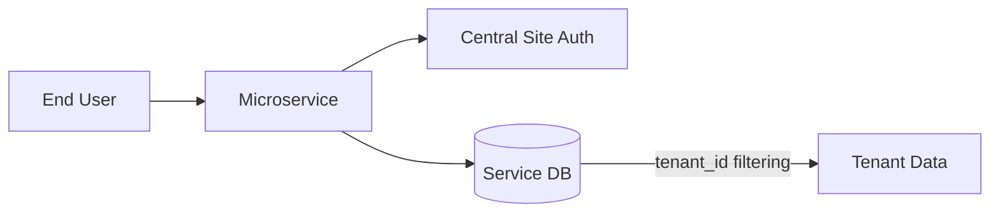

# Architecture & Isolation

## Bounded Context

In a true microservices architecture, each service must own its data. The Frappe Microservice Framework promotes this by encouraging an **Independent Database** for each service.

- **Central Site**: Acts as the "Source of Truth" for authentication and global user state.
- **Service Database**: Contains only the DocTypes relevant to the service's bounded context.

## External Dependencies

### Central Site & `saas_platform` App

The framework relies on a **Central Site** running a specific Frappe app called [saas_platform](file:///Users/varkrish/personal/saas_platform).

- **Tenant Identification**: The `saas_platform` app is responsible for adding the `tenant_id` field to the `User` DocType on the Central Site.
- **Session Validation**: When a microservice validates a session, it expects the Central Site to return a user profile that includes this `tenant_id`.
- **Data Isolation**: Without the `saas_platform` app on the Central Site, the microservice will not be able to resolve the user's tenant, effectively disabling multi-tenant data isolation.

## Strategy: Granular Decomposition of ERPNext

One of the primary goals of this framework is to enable the **gradual decomposition of monolithic ERPNext** into smaller, manageable microservices.

Instead of a high-risk "big bang" migration, teams can:
1.  **Identify a Module**: Choose a specific module (e.g., "Orders", "Signups", "Inventory").
2.  **Define a Bounded Context**: Extract relevant DocTypes to a new service-specific database.
3.  **Implement via Framework**: Use the Frappe Microservice Framework to expose APIs and business logic.
4.  **Secure Integration**: Leverage the Central Site for unified authentication across all microservices.

This approach allows for independent scaling, faster deployment cycles, and technology diversification while maintaining the power of Frappe's DocType system.

## Multi-Tenancy

The framework is built for SaaS applications. It assumes a "Single Site, Multi-Tenant" model where data is isolated using a `tenant_id` field.

### TenantAwareDB

The `app.tenant_db` object is a wrapper around Frappe's database methods. It automatically ensures that:
1.  **Filtering**: All `get_all` calls include a `tenant_id` filter in the `WHERE` clause.
2.  **Validation**: All `get_doc` calls verify that the requested document belongs to the current user's tenant.
3.  **Inheritance**: All `insert_doc` calls automatically set the `tenant_id` from the current request context.

### Authentication & Identification

1.  A user logs in to the **Central Site**.
2.  The microservice receives the request with the `sid` cookie.
3.  `MicroserviceApp` validates the session against the Central Site.
4.  The user's `tenant_id` is resolved and stored in the request context (`flask.g`).
5.  All database operations are now scoped to that `tenant_id`.

## Database Diagram (Example)

